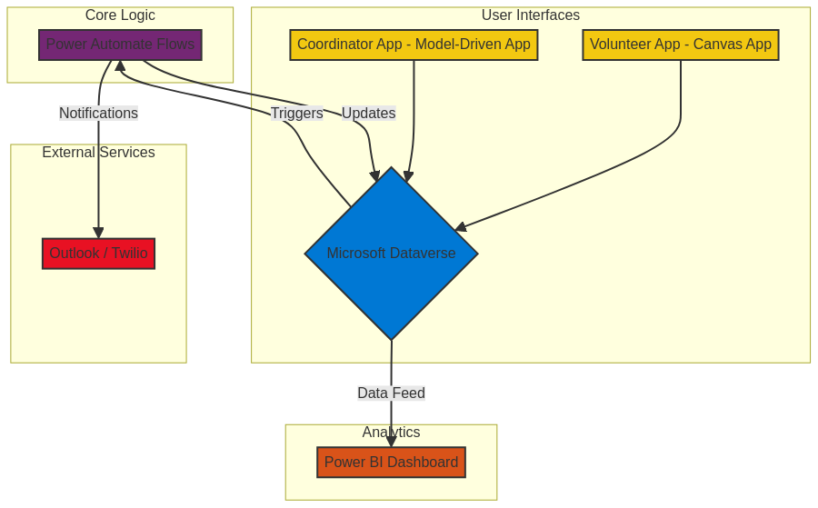

# Open-Source Emergency Response Coordination Platform: Implementation Guide

## **Project Overview**

This platform is a low-code solution built on the Microsoft Power Platform, designed to provide small municipalities and non-governmental organizations (NGOs) with a robust, low-cost system for coordinating emergency response efforts. It enables the management of volunteers, the dispatch of resources, and real-time operational oversight during a crisis.

## **Core Components**

1.  **Dataverse (Data Model):** The central database storing all information.
2.  **Power Apps (Interfaces):**
    *   **Volunteer App (Canvas App):** For volunteers to register, set their availability, and view assigned tasks.
    *   **Coordinator App (Model-Driven App):** For response leaders to manage volunteers, create tasks, dispatch resources, and monitor operations.
3.  **Power Automate (Workflows):** Automates notifications, approvals, and data processing.
4.  **Power BI (Dashboard):** Provides a real-time, map-based visualization of the entire operation for strategic decision-making.

## **Step-by-Step Deployment Instructions**

**Prerequisites:**
*   A Microsoft 365 environment with Power Apps licensing (most non-profits are eligible for free or heavily discounted licenses).
*   Appropriate administrative permissions to create environments and manage solutions.

**Step 1: Set Up the Power Platform Environment**
1.  Navigate to the [Power Platform Admin Center](https://admin.powerplatform.microsoft.com/).
2.  Create a new, dedicated environment for this solution (e.g., "Emergency Response").
3.  In the new environment, create a Dataverse database.

**Step 2: Import the Solution**
1.  Download the solution file (`EmergencyResponsePlatform_v1_0.zip`) from this repository's "Releases" section.
2.  In your new "Emergency Response" environment, go to **Solutions** > **Import solution**.
3.  Select the downloaded `.zip` file and follow the on-screen prompts. The import process will create all the necessary Dataverse tables, Power Apps, and Power Automate flows.

**Step 3: Configure Power Automate Connections**
1.  After the solution is imported, navigate to **Solutions** and open the "Emergency Response Platform" solution.
2.  Find the Power Automate flows (e.g., "Notify Volunteer of New Task," "Process New Volunteer Registration").
3.  Open each flow and ensure the connections (to Dataverse, Outlook, and/or Twilio for SMS) are authenticated and working correctly. You may need to create new connections using your organization's accounts.

**Step 4: Configure the Power BI Dashboard**
1.  Open the Power BI Desktop file (`EmergencyResponseDashboard.pbix`) from the repository.
2.  In the "Transform data" menu, go to "Data source settings."
3.  Update the data source to point to your new Dataverse environment URL. You can find this URL in the Power Apps portal under **Settings** > **Session details**.
4.  Enter your credentials to connect to the data.
5.  Once connected and refreshed, publish the report to your Power BI service.
6.  Use the "Publish to web (public)" feature to get an embed code for sharing the dashboard on a public website, or share it internally with stakeholders.

**Step 5: Share the Power Apps with Users**
1.  Navigate to **Apps** in your Power Platform environment.
2.  For the **"Volunteer App" (Canvas App):**
    *   Click the "..." (ellipsis) and select **Share**.
    *   Share it with the security group containing your volunteers (or with the entire organization).
    *   Ensure you grant them permissions to use the underlying Dataverse tables.
3.  For the **"Coordinator App" (Model-Driven App):**
    *   Share this app with the security group for your response coordinators and leadership.
    *   This app provides full control over the data, so access should be restricted.

**Deployment is now complete.** Coordinators can begin adding volunteers and managing tasks, and the Power BI dashboard will reflect operations in real-time.

## **System Architecture**

The following diagram illustrates the high-level architecture of the platform, showing the relationships between the different Power Platform components.

## **Data Model**

The solution utilizes several key tables within Dataverse to store and manage all operational data. The core tables are:

| Table Name | Description | Key Columns |
| --- | --- | --- |
| **Volunteer** | Stores information about each registered volunteer. | `Name`, `ContactInfo`, `Skills`, `AvailabilityStatus` |
| **Skill** | A lookup table for skills that volunteers can possess. | `SkillName`, `Description` |
| **Task** | Contains details about each task that needs to be completed. | `TaskName`, `Description`, `Location`, `Status`, `AssignedVolunteer` |
| **Resource** | Tracks physical resources or assets available for dispatch. | `ResourceName`, `ResourceType`, `CurrentLocation`, `Status` |
| **Incident** | Records details of specific incidents or events being managed. | `IncidentName`, `Location`, `Description`, `StartTime` |

